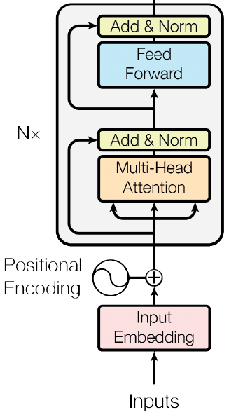
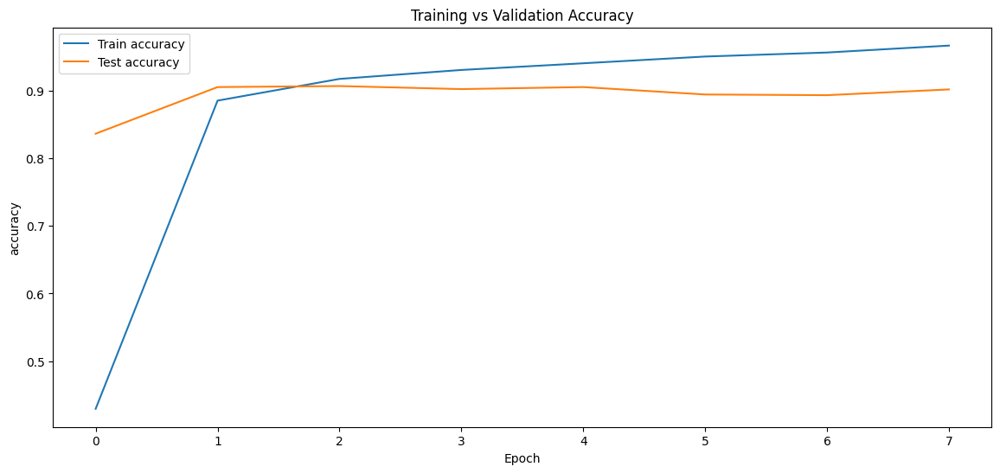
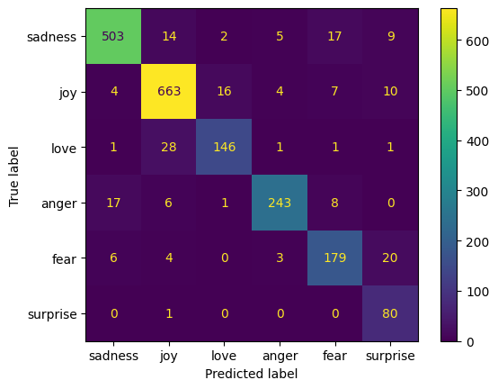

# Emotion Classification using a Transformer Encoder Built from Scratch

A Natural Language Processing (NLP) project that implements a Transformer Encoder from scratch using TensorFlow/Keras for multi-class emotion classification.

Instead of relying on TensorFlow's built-in `MultiHeadAttention` layer, the attention mechanism was implemented manually to better understand the internal components of Transformer architectures, including Multi-Head Self Attention, Positional Embeddings, Residual Connections, Layer Normalization, and Feed Forward Networks.

The model is trained on the `dair-ai/emotion` dataset and achieves approximately  **91% validation accuracy** .

<div align="center">
  
</div>
---

## Project Structure

```text
Emotion-Transformer-From-Scratch/
│
├── assets/
│   ├── transformer_architecture.png
│   ├── training_performance.png
│   └── confusion_matrix.png
│
├── emotion_transformer_from_scratch.ipynb
├── README.md
└── requirements.txt
```

---

## Features

* Custom Multi-Head Self Attention implementation
* Learnable Token Embeddings
* Learnable Positional Embeddings
* Residual Connections
* Layer Normalization
* Feed Forward Network (FFN)
* Stacked Transformer Encoder Blocks
* EarlyStopping and ModelCheckpoint
* Classification Report Evaluation
* Confusion Matrix Visualization

---

## Dataset

This project uses the `dair-ai/emotion` dataset from Hugging Face.

The dataset contains text samples classified into six emotion categories:

| Label | Emotion  |
| ----- | -------- |
| 0     | Sadness  |
| 1     | Joy      |
| 2     | Love     |
| 3     | Anger    |
| 4     | Fear     |
| 5     | Surprise |

Dataset Split:

* Training Samples: 16,000
* Validation Samples: 2,000

---

## Architecture

The model follows the pipeline below:

```text
Input Text
     ↓
Tokenizer
     ↓
Token Embedding
     ↓
Positional Embedding
     ↓
Transformer Encoder × 4
     ↓
GlobalAveragePooling1D
     ↓
Dense (GELU)
     ↓
Dropout
     ↓
Softmax Classification Head
```

Model Configuration:

| Parameter               | Value |
| ----------------------- | ----- |
| Embedding Dimension     | 128   |
| Number of Heads         | 8     |
| Encoder Layers          | 4     |
| FFN Dimension           | 256   |
| Vocabulary Size         | 5000  |
| Maximum Sequence Length | 100   |
| Learning Rate           | 3e-4  |

---

## Training

The model was trained using:

* Adam Optimizer
* Sparse Categorical Crossentropy Loss
* EarlyStopping
* ModelCheckpoint

Training was stopped automatically using EarlyStopping to reduce overfitting and restore the best model weights.

---

## Results

### Validation Accuracy

**~91%**

### Training Curves

<div align="center">
  
</div>


### Confusion Matrix

<div align="center">
  
</div>

---

### Classification Report


| Emotion  | F1 Score |
| -------- | -------- |
| Sadness  | 0.93     |
| Joy      | 0.93     |
| Love     | 0.85     |
| Anger    | 0.92     |
| Fear     | 0.84     |
| Surprise | 0.80     |

Overall Accuracy: **91%**

---

## Installation

Clone the repository:

```bash
git clone https://github.com/AserSayyd2009/Emotion-Transformer-From-Scratch.git
cd Emotion-Transformer-From-Scratch
```

Install dependencies:

```bash
pip install -r requirements.txt
```

Run the notebook:

```bash
jupyter notebook emotion_transformer_from_scratch.ipynb
```

---

## Technologies Used

* Python
* TensorFlow
* Keras
* NumPy
* Pandas
* Matplotlib
* Scikit-Learn
* Hugging Face Datasets

---

## Future Improvements

* Attention Masking
* CLS Token Classification Head
* Attention Visualization
* Learning Rate Scheduling
* Larger Transformer Architectures

---

## Educational Purpose

This project was created to gain a deeper understanding of Transformer Encoder architectures and their internal components by implementing them manually rather than relying on high-level pre-built layers.
